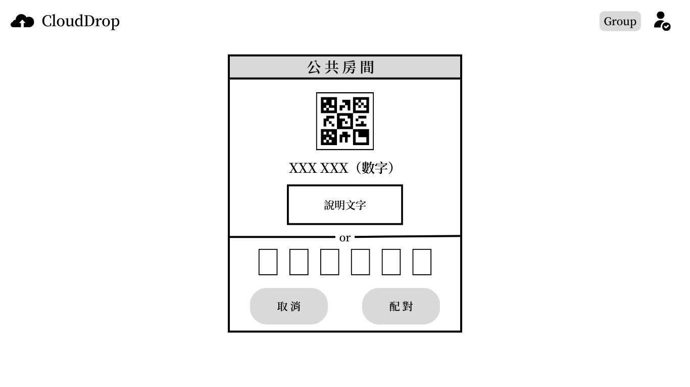
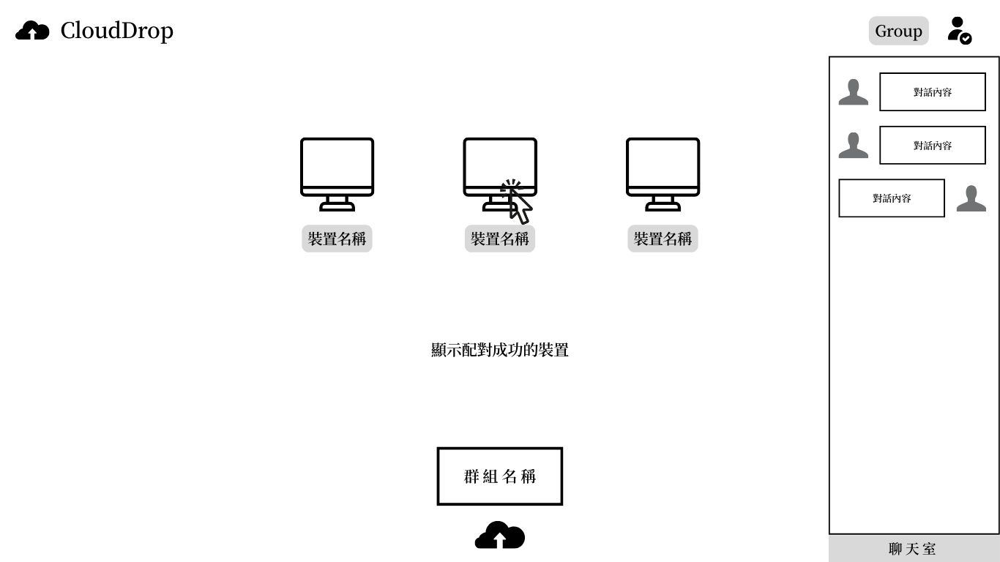
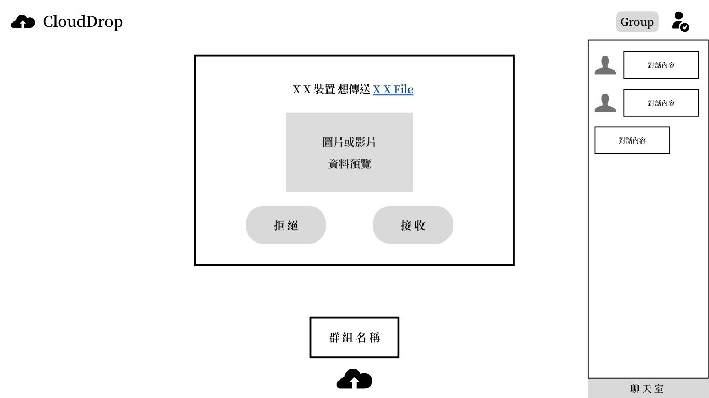
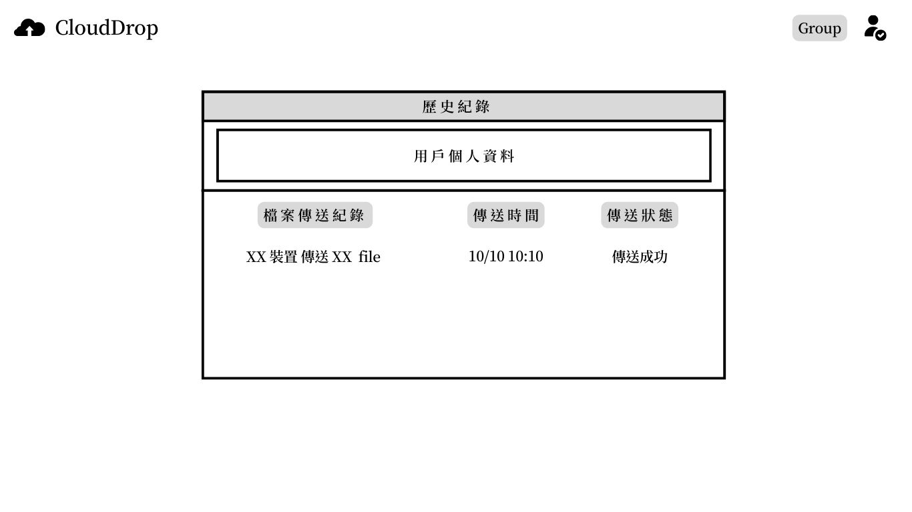
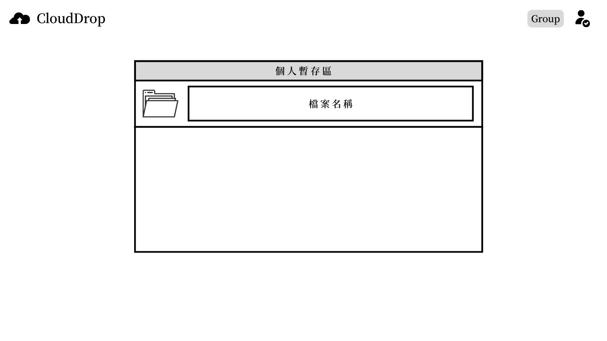

# 專案介紹

## 核心功能

### 功能一：檔案傳輸

#### Step 1：裝置配對

-   同網路（P2P）
    -   可以直接看到對方裝置，選擇目標，進行檔案傳輸（如上圖藍色框框的內容）
-   不同網路
    -   利用 qrcode 掃描或輸入驗證碼，創建或加入一個房間

#### Step 2：檔案傳遞

-   檔案傳送
    -   可以選擇傳送「自己裝置的檔案」或「雲端硬碟的檔案」
-   檔案接收
    -   圖片或影片資料提供「預覽功能」
    -   收到檔案後使用者可以選擇
        -   將檔案下載
        -   存到我們服務的個人暫存區
        -   存到其他地方，例如：雲端硬碟

#### [其他功能] 聊天室

-   可以進行文字交流，確保收到的東西符合預期，或資料有正確傳輸

### 功能二：個人檔案管理

#### 個人暫存區

-   暫時保存檔案
-   可以選擇把檔案額外存到其他地方，例如：雲端硬碟

#### 歷史紀錄

-   紀錄「裝置配對」以及「檔案傳送、接收」的歷史資料

## UI 設計

[UI 設計展示（完整版）](https://www.canva.com/design/DAGTQIqe4TY/tgdKWRnrJNSgZ2VSfUMM0Q/edit?utm_content=DAGTQIqe4TY&utm_campaign=designshare&utm_medium=link2&utm_source=sharebutton)

### 重要功能介面設計

-   裝置配對介面（不同網路）

      

-   裝置配對成功介面

      

-   檔案接收

      

-   歷史紀錄

      

-   個人暫存庫

      

## 系統架構

### P2P 架構

### 其他服務架構

