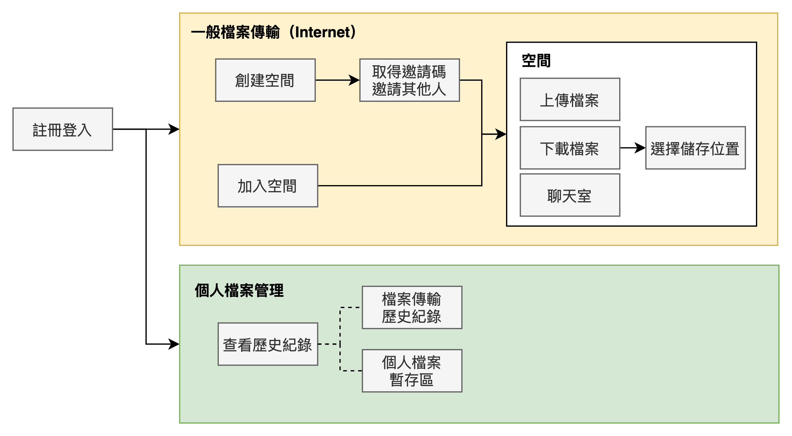
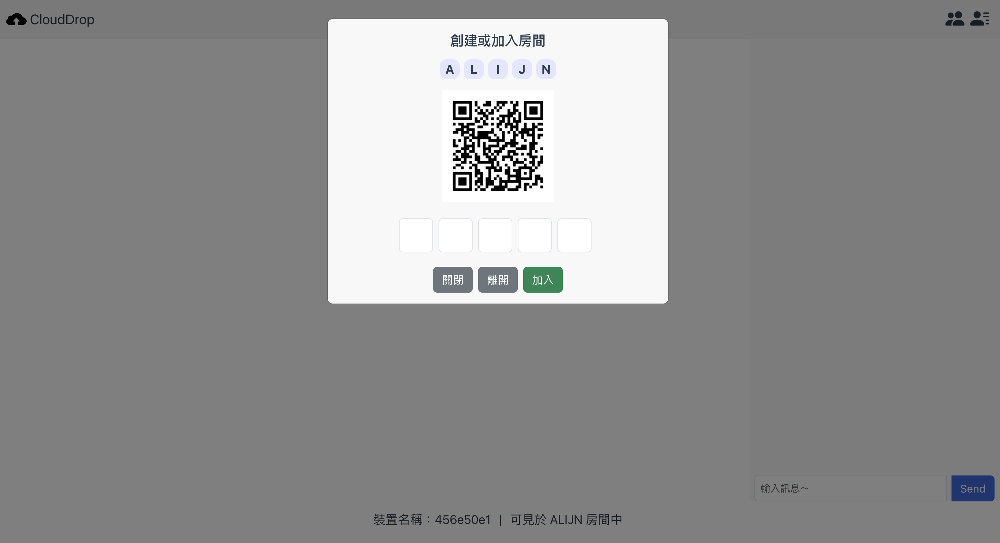
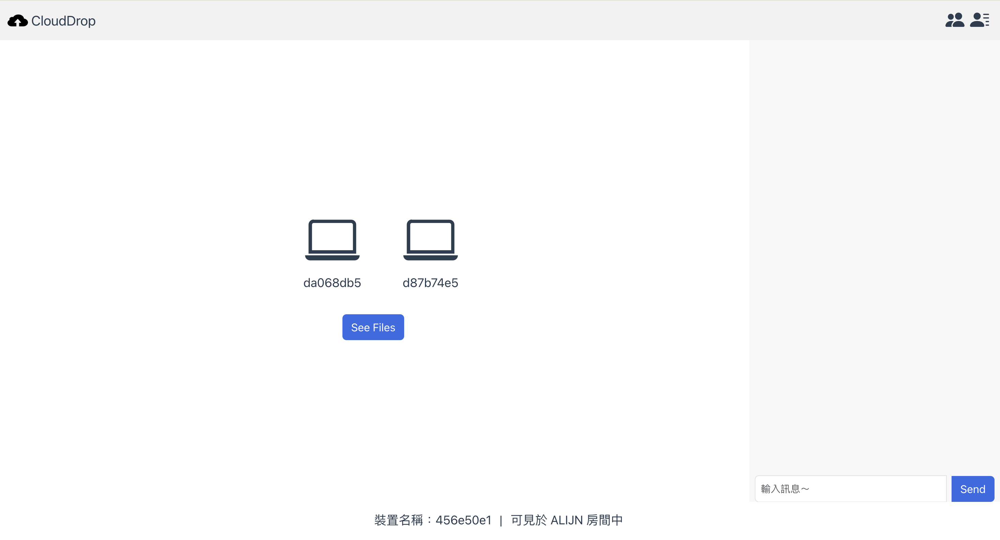
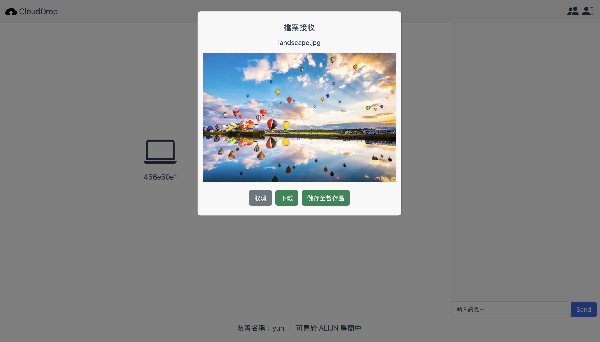
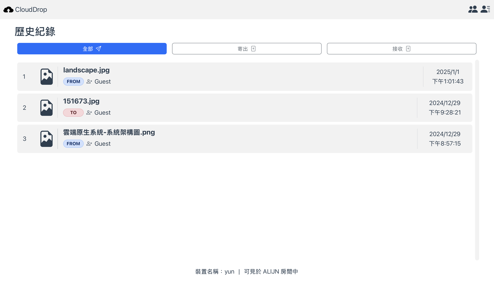
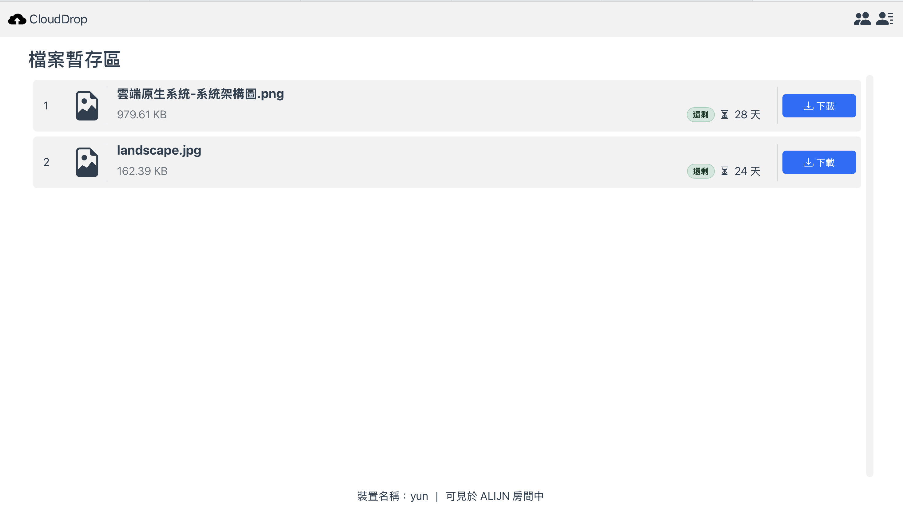
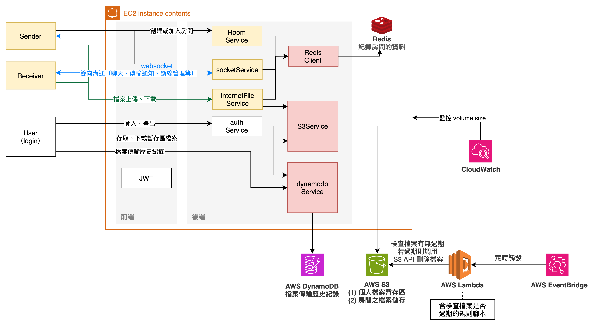

# 專案介紹

## 核心功能

### 功能一：檔案傳輸

#### Step 1：裝置配對

利用 qrcode 掃描或輸入驗證碼，創建或加入一個房間

#### Step 2：檔案傳遞

檔案傳送

-   傳送給特定一個裝置
-   傳送給房間裡的所有人

檔案接收

-   圖片資料提供「預覽功能」
-   收到檔案後使用者可以選擇
    -   將檔案下載
    -   存到個人暫存區

#### [其他功能] 1. 聊天室

-   加入房間後，可以進行文字交流，確保收到的東西符合預期，或資料有正確傳輸

#### [其他功能] 2. 房間暫存區

-   **傳送給房間裡所有人**的檔案將被儲存，並且讓後進入房間的人也能透過房間的暫存區下載

### 功能二：個人檔案管理

#### 個人暫存區

-   暫時保存檔案
-   顯示檔案剩餘儲存時間、檔案大小等資訊

#### 歷史紀錄

-   紀錄「檔案傳送、接收」的歷史資料

## UI 設計 ＆ 實際功能介面

[UI 設計展示（完整版）](https://www.canva.com/design/DAGTQIqe4TY/tgdKWRnrJNSgZ2VSfUMM0Q/edit?utm_content=DAGTQIqe4TY&utm_campaign=designshare&utm_medium=link2&utm_source=sharebutton)

### 實際功能介面

-   裝置配對介面

      

-   裝置配對成功介面

      

-   檔案接收

      

-   歷史紀錄

      

-   個人暫存庫

      

## 系統架構

### 參考資料

-   [媒體協商與 SDP](https://ithelp.ithome.com.tw/m/articles/10267342)
