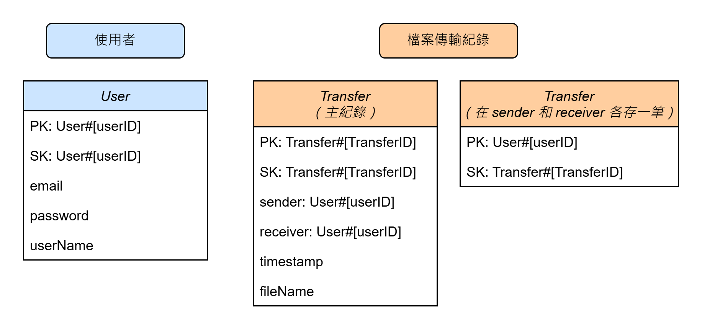
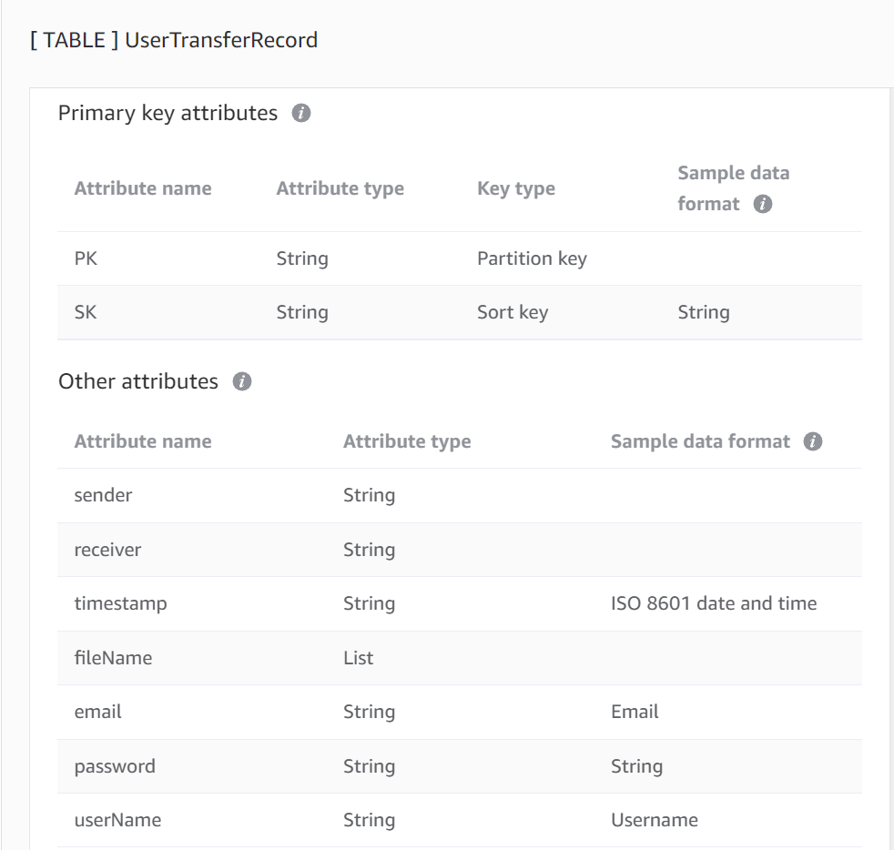
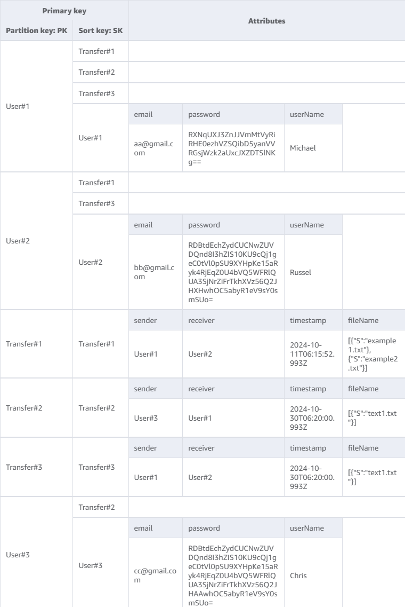
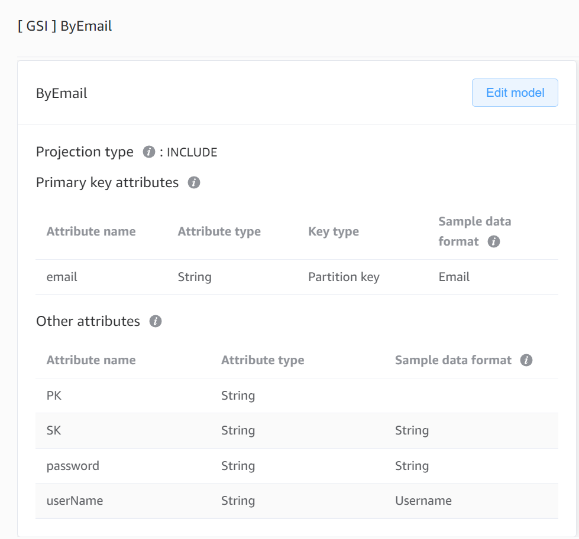
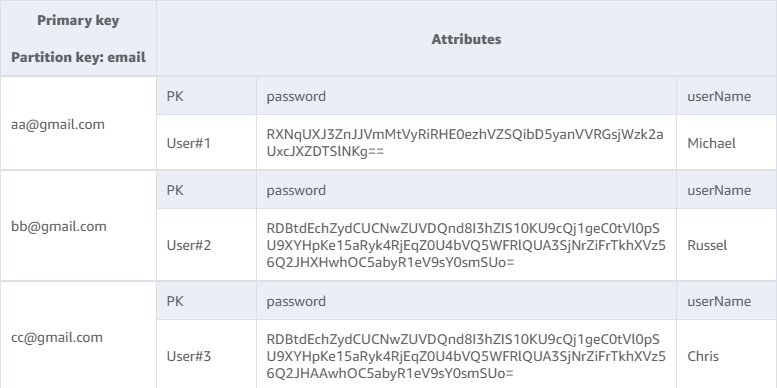

# Table Schema

| 資料庫                | 儲存內容                               |
| --------------------- | -------------------------------------- |
| [DynamoDB](#dynamodb) | 1. 使用者資訊<br>2. 檔案傳輸紀錄       |
| [Redis](#redis)       | 1. 房間邀請碼<br>2. 房間成員           |
| [S3](#s3)             | 1. 個人暫存區檔案<br>2. 房間暫存區檔案 |

## DynamoDB

**儲存內容：**

1. 使用者資訊
2. 檔案傳輸紀錄

**儲存結構：**



**Table 結構：**

（以單表的方式儲存）

1.  **[ TABLE ] UserTransferRecord**

    

    儲存形式範例：

    

    結構設計對應功能：

    1. 由 userID，取得與他有關的所有傳輸紀錄，無論該使用者是 sender 或 receiver

        | 步驟                                 | query 方式（PK）           | query 方式（SK）           |
        | ------------------------------------ | -------------------------- | -------------------------- |
        | 1. 由使用者取得跟他有關的 transferID | PK = User#[userID]         | SK begins_with(Transfer#)  |
        | 2. 由 transferID 查該次傳輸相關內容  | PK = Transfer#[transferID] | SK = Transfer#[transferID] |

    2. 取得單筆傳輸紀錄的所有資訊

        | 步驟                                | query 方式（PK）           | query 方式（SK）           |
        | ----------------------------------- | -------------------------- | -------------------------- |
        | 1. 由 transferID 查該次傳輸相關內容 | PK = Transfer#[transferID] | SK = Transfer#[transferID] |

2.  **[ GSI ] ByEmail**

    

    儲存形式範例：

    

    結構設計對應功能：

    1. 由 email 取得使用者資訊

        | 步驟                    | IndexName | query 方式（PK） |
        | ----------------------- | --------- | ---------------- |
        | 由 email 取得使用者資訊 | ByEmail   | PK = [email]     |

        後續抓出資料後就可以在檢查密碼是否吻合後，取得使用者名稱及使用者 ID。

## Redis

### 房間管理

**儲存內容：**

1. 這個房間有哪些成員
2. 這個使用者在哪一間房間

**儲存結構：**

```
roomToken: (set) {userIds}
userId:{userId}: (String) roomToken
```

### 檔案管理

**儲存內容：**

1. 這個檔案的內容雜湊值
2. 這個檔案的原始檔名
3. Bloomfilter 的 array

**儲存結構：**

```
file:{fileId}:hash: 檔案內容雜湊值
file:{fileId}:filename: 檔案原始名稱
bloomfilter: array
```

## S3

**儲存內容：**

1. 個人暫存區檔案
2. 房間暫存區檔案

**儲存結構：**

1. 個人暫存區檔案：`user/[userID]/[file_uuid]`
2. 房間暫存區檔案：`room/[roomID]/[file_uuid]`

利用檔案名稱前綴，區別同一個 bucket 中不同檔案分別歸屬於哪個使用者或是房間。

**儲存形式範例：**

```bash
bucket/
├── user/
│   ├── 123
│       ├── file1.jpg
│       └── file2.png
│   ├── 456
│       ├── document.pdf
│       └── photo.jpg
├── room/
│   ├── 001
│       ├── file1.jpg
│       └── file2.png
│   ├── 002
│       ├── document.pdf
│       └── photo.jpg
```
